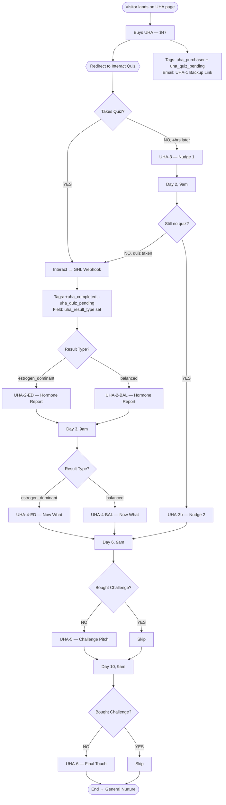

# UHA Flow — Visual Reference

Companion to `uha-build-spec.md`. Designed to be read at a glance.

---

## 1. Big Picture (one diagram, whole flow)



---

## 2. Timeline View — What Fires When

```
T+0 min    ═══════════════════════════════════════════════════
           ● UHA Purchase
           ● Tag: uha_purchaser + uha_quiz_pending
           ● Email: UHA-1 (Backup quiz link)
           ● Redirect: → Interact Quiz

T+??       ─ ─ ─ ─ (buyer takes quiz whenever)
           ● Webhook fires → GHL
           ● Tag: +uha_completed, -uha_quiz_pending
           ● Field: uha_result_type = ED or BAL
           ● Email: UHA-2-ED or UHA-2-BAL

T+4 hrs    ═══════════════════════════════════════════════════
           IF quiz NOT taken → Email: UHA-3 (Nudge 1)

Day 2  9am ═══════════════════════════════════════════════════
           IF quiz NOT taken → Email: UHA-3b (Nudge 2)

Day 3  9am ═══════════════════════════════════════════════════
           IF quiz WAS taken → Email: UHA-4-ED or UHA-4-BAL

Day 6  9am ═══════════════════════════════════════════════════
           IF not purchased_challenge → Email: UHA-5 (Pitch)

Day 10 9am ═══════════════════════════════════════════════════
           IF not purchased_challenge → Email: UHA-6 (Final)
           → END workflow → General Nurture
```

---

## 3. The Two Paths — Quiz Taker vs Quiz Skipper

```
┌────────────────────────────────────────────────────────────┐
│                    BUYS UHA ($47)                          │
│                Tag: uha_purchaser                          │
│               Email: UHA-1 (backup link)                   │
└──────────────────────────┬─────────────────────────────────┘
                           │
                ┌──────────┴──────────┐
                │                     │
                ▼                     ▼
       ┌─────────────────┐   ┌─────────────────┐
       │   PATH A:       │   │   PATH B:       │
       │   TAKES QUIZ    │   │   SKIPS QUIZ    │
       └────────┬────────┘   └────────┬────────┘
                │                     │
                ▼                     ▼
      Webhook from Interact    +4 hrs: UHA-3
                │              Day 2 9am: UHA-3b
                ▼                     │
         Tag: uha_completed           │
                │                     │
                ▼                     │
         UHA-2 (ED or BAL)            │
                │                     │
                ▼                     │
         Day 3: UHA-4 (ED or BAL)     │
                │                     │
                └──────────┬──────────┘
                           ▼
                     Day 6 9am
              ┌────────────┴────────────┐
              │                         │
         Has purchased_challenge?       │
         YES: skip UHA-5                │
         NO:  send UHA-5                │
              └────────────┬────────────┘
                           ▼
                     Day 10 9am
              ┌────────────┴────────────┐
              │                         │
         Has purchased_challenge?       │
         YES: skip UHA-6                │
         NO:  send UHA-6                │
              └────────────┬────────────┘
                           ▼
                       END WORKFLOW
                   → General Nurture
```

---

## 4. Tag State Transitions

| Stage | `uha_purchaser` | `uha_quiz_pending` | `uha_completed` | `uha_result_type` |
|---|:-:|:-:|:-:|:-:|
| Pre-purchase | — | — | — | null |
| Post-checkout | ✅ | ✅ | — | null |
| Quiz completed | ✅ | — | ✅ | ED or BAL |
| Day 10+ (end) | ✅ | *varies* | *varies* | *varies* |

---

## 5. Email Decision Matrix

**Which emails fire in each scenario?**

| Email | Quiz Taker (ED) | Quiz Taker (BAL) | Quiz Skipper | Bought Challenge Day 5 |
|---|:-:|:-:|:-:|:-:|
| UHA-1 Backup link | ✅ | ✅ | ✅ | ✅ |
| UHA-2-ED Report | ✅ | — | — | ✅ (if took quiz as ED) |
| UHA-2-BAL Report | — | ✅ | — | ✅ (if took quiz as BAL) |
| UHA-3 Nudge 1 (4hr) | — | — | ✅ | — |
| UHA-3b Nudge 2 (D2) | — | — | ✅ | — |
| UHA-4-ED Now What | ✅ | — | — | ✅ (Day 3, before D5) |
| UHA-4-BAL Now What | — | ✅ | — | ✅ (Day 3, before D5) |
| UHA-5 Pitch (D6) | ✅ | ✅ | ✅ | ❌ skipped |
| UHA-6 Final (D10) | ✅ | ✅ | ✅ | ❌ skipped |

Legend: ✅ = sends · — = does not fire · ❌ skipped = conditional suppression

---

## 6. WF-1 Post-Purchase — Node Diagram

```
┌─────────────────────────────────────────┐
│ TRIGGER: Tag Added = "uha_purchaser"    │
└────────────────────┬────────────────────┘
                     ▼
          ┌──────────────────────┐
          │  Send Email: UHA-1   │
          └──────────┬───────────┘
                     ▼
          ┌──────────────────────┐
          │   Wait: 4 hours      │
          └──────────┬───────────┘
                     ▼
          ┌──────────────────────┐
          │ IF/ELSE:             │
          │ NOT has tag          │
          │ "uha_completed"      │
          └───┬──────────────┬───┘
              │ YES          │ NO
              ▼              ▼
    ┌───────────────┐       (skip)
    │ Send: UHA-3   │        │
    └───────┬───────┘        │
            └────────┬───────┘
                     ▼
          ┌──────────────────────┐
          │  Wait Until: Day 2,  │
          │       9:00 AM        │
          └──────────┬───────────┘
                     ▼
          ┌──────────────────────┐
          │ IF/ELSE:             │
          │ NOT has tag          │
          │ "uha_completed"      │
          └───┬──────────────┬───┘
              │ YES          │ NO
              ▼              ▼
    ┌───────────────┐       (skip)
    │ Send: UHA-3b  │        │
    └───────┬───────┘        │
            └────────┬───────┘
                     ▼
          ┌──────────────────────┐
          │  Wait Until: Day 6,  │
          │       9:00 AM        │
          └──────────┬───────────┘
                     ▼
          ┌──────────────────────┐
          │ IF/ELSE:             │
          │ NOT has tag          │
          │ "purchased_challenge"│
          └───┬──────────────┬───┘
              │ YES          │ NO
              ▼              ▼
    ┌───────────────┐       (skip)
    │ Send: UHA-5   │        │
    └───────┬───────┘        │
            └────────┬───────┘
                     ▼
          ┌──────────────────────┐
          │  Wait Until: Day 10, │
          │       9:00 AM        │
          └──────────┬───────────┘
                     ▼
          ┌──────────────────────┐
          │ IF/ELSE:             │
          │ NOT has tag          │
          │ "purchased_challenge"│
          └───┬──────────────┬───┘
              │ YES          │ NO
              ▼              ▼
    ┌───────────────┐       (skip)
    │ Send: UHA-6   │        │
    └───────┬───────┘        │
            └────────┬───────┘
                     ▼
              ┌──────────────┐
              │ END WORKFLOW │
              └──────────────┘
```

---

## 7. WF-2 Quiz Results — Node Diagram

```
┌─────────────────────────────────────────┐
│ TRIGGER: Inbound Webhook from Interact  │
└────────────────────┬────────────────────┘
                     ▼
          ┌──────────────────────┐
          │  Find Contact by     │
          │  email (create if    │
          │  not found)          │
          └──────────┬───────────┘
                     ▼
          ┌──────────────────────┐
          │ Update Fields:       │
          │  first_name          │
          │  uha_result_type     │
          │  uha_quiz_completed_at│
          └──────────┬───────────┘
                     ▼
          ┌──────────────────────┐
          │ Add tag:             │
          │   uha_completed      │
          │ Remove tag:          │
          │   uha_quiz_pending   │
          └──────────┬───────────┘
                     ▼
          ┌──────────────────────┐
          │ IF/ELSE:             │
          │ uha_result_type =    │
          │ "estrogen_dominant"  │
          └───┬──────────────┬───┘
              │ YES          │ NO (balanced)
              ▼              ▼
    ┌───────────────┐  ┌───────────────┐
    │ Send: UHA-2-ED│  │Send: UHA-2-BAL│
    └───────┬───────┘  └───────┬───────┘
            └────────┬─────────┘
                     ▼
          ┌──────────────────────┐
          │  Wait Until: Day 3   │
          │  after purchase,     │
          │  9:00 AM             │
          └──────────┬───────────┘
                     ▼
          ┌──────────────────────┐
          │ IF/ELSE:             │
          │ uha_result_type =    │
          │ "estrogen_dominant"  │
          └───┬──────────────┬───┘
              │ YES          │ NO (balanced)
              ▼              ▼
    ┌───────────────┐  ┌───────────────┐
    │ Send: UHA-4-ED│  │Send: UHA-4-BAL│
    └───────┬───────┘  └───────┬───────┘
            └────────┬─────────┘
                     ▼
              ┌──────────────┐
              │ END WORKFLOW │
              └──────────────┘
```

---

## 8. Data Contract — Interact → GHL Webhook

```
┌─────────────────────────┐        ┌─────────────────────────┐
│      INTERACT           │        │          GHL            │
│   (UHA Quiz — 48 Qs)    │        │   Inbound Webhook WF    │
└───────────┬─────────────┘        └───────────▲─────────────┘
            │                                  │
            │     POST  (JSON)                 │
            │                                  │
            │     {                            │
            │       "email":              ─────┼──► Standard: Email
            │       "first_name":         ─────┼──► Standard: First Name
            │       "uha_result_type":    ─────┼──► Custom: uha_result_type
            │       "uha_quiz_completed_at":──┼──► Custom: uha_quiz_completed_at
            │     }                            │
            └──────────────────────────────────┘

MUST: uha_result_type value = "estrogen_dominant" OR "balanced" (exact)
```

---

## 9. QA Test Matrix — At a Glance

| Scenario | Setup | Expected Emails |
|---|---|---|
| **A** Happy path — ED | Buy + take quiz fast (ED) | UHA-1 → UHA-2-ED → UHA-4-ED → UHA-5 → UHA-6 |
| **B** Happy path — BAL | Buy + take quiz fast (BAL) | UHA-1 → UHA-2-BAL → UHA-4-BAL → UHA-5 → UHA-6 |
| **C** No quiz | Buy, never take quiz | UHA-1 → UHA-3 → UHA-3b → UHA-5 → UHA-6 |
| **D** Cross-sell suppression | Buy + quiz + manually tag `purchased_challenge` before D6 | UHA-1 → UHA-2 → UHA-4 → (UHA-5 skipped) → (UHA-6 skipped) |

---

## 10. At-a-Glance Summary

| | |
|---|---|
| **Total workflows** | 3 (Order-Intake, WF-1 Post-Purchase, WF-2 Quiz Results) |
| **Total emails** | 9 templates (7 unique + 2 conditional variants) |
| **Total tags** | 4 (uha_purchaser, uha_quiz_pending, uha_completed, purchased_challenge) |
| **Total custom fields** | 3 (uha_result_type, uha_quiz_completed_at, uha_purchase_date) |
| **Integration points** | 1 (Interact → GHL webhook) |
| **Flow duration** | 10 days then hands off to general nurture |
| **Stack** | Interact + GHL only. No Kajabi. |

---

**Pair this with `uha-build-spec.md` for implementation details.**
